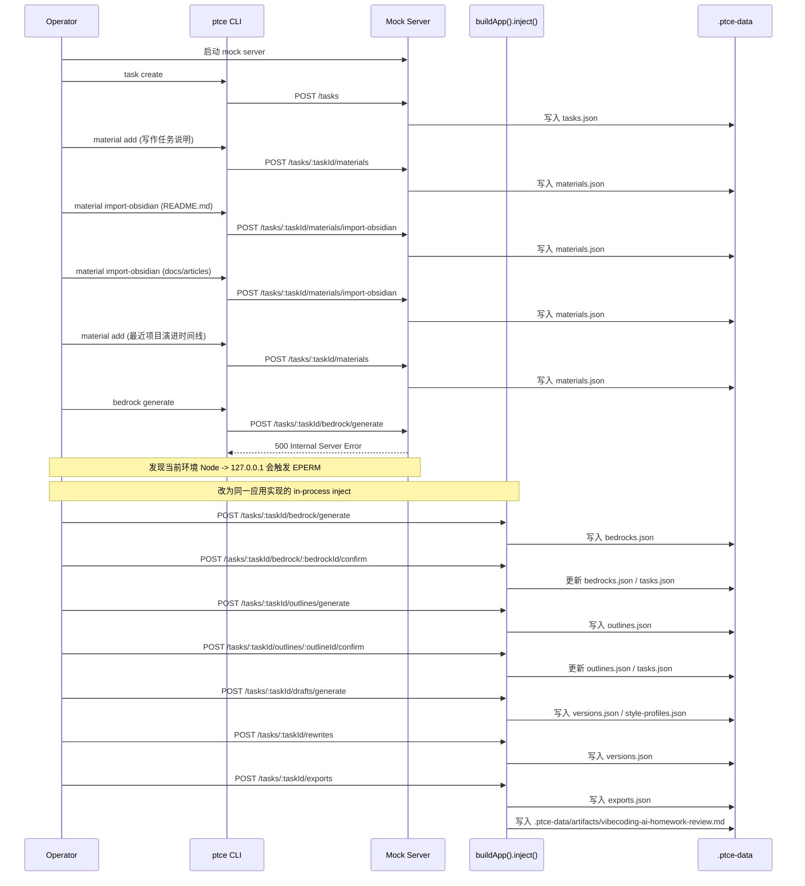

# AI Homework Review 写作任务真实调用链路

## 结论

这次任务的**领域链路**确实按预设顺序走完了：

`task -> material -> bedrock -> outline -> draft -> rewrite -> export`

但这次任务的**传输链路**不是全程同一种方式：

- 前半段是 `CLI -> mock server HTTP route`
- 从 `bedrock` 开始，因为当前环境中 Node 到 `127.0.0.1` 的连接会报 `EPERM`，后半段改成了 `buildApp(...).inject(...)`

所以准确表述应该是：

> 预设的业务链路走完了，且走的是同一套应用服务实现。  
> 但没有做到“全程真实 CLI 通过 TCP 调接口”。

## 真实对象记录

- `taskId`: `task-c4d367fe-6c40-4304-a48b-0e1157fc1563`
- `bedrockId`: `bedrock-88312e51-c500-43f6-9b16-becf416487be`
- `outlineId`: `outline-49472362-93a4-4b3e-b211-03350c023ed2`
- `draftVersionId`: `version-88e19ac3-68d1-482a-bb3b-721296cad97d`
- `rewriteVersionId`: `version-b0fcf410-002b-4948-a42c-3e4883e14312`
- `exportRecordId`: `export-380cfca5-3058-4705-a511-93d6e97f0521`

任务最终状态：

- `stage=exported`
- `createdAt=2026-04-26T10:24:56.985Z`
- `updatedAt=2026-04-26T10:27:45.487Z`

## 实际材料输入

这次任务实际喂入了 4 份材料：

1. `prompt / inline`
   - 标题：`写作任务说明`
2. `article / obsidian`
   - 标题：`从“假演示”到“真实可用”：一个 AI 作业批改网站的完整开发复盘`
   - 来源路径：`docs/articles/2026-04-11-ai-homework-review-build-retrospective.md`
3. `article / obsidian`
   - 标题：`用 GitHub Pages + 阿里云，我低成本上线了一个真实可用的 AI 网站`
   - 来源路径：`docs/articles/2026-04-12-low-cost-ai-site-deployment-playbook.md`
4. `note / inline`
   - 标题：`最近项目演进时间线`

## 实际调用顺序

## 每一步落盘结果

### 1. task create

- 输出：`task-c4d367fe-6c40-4304-a48b-0e1157fc1563`
- 落盘：`.ptce-data/tasks.json`

### 2. material add / import-obsidian

- 输出：4 条 `Material`
- 落盘：`.ptce-data/materials.json`

### 3. bedrock generate + confirm

- 输出：`bedrock-88312e51-c500-43f6-9b16-becf416487be`
- 落盘：`.ptce-data/bedrocks.json`

### 4. outline generate + confirm

- 输出：`outline-49472362-93a4-4b3e-b211-03350c023ed2`
- 落盘：`.ptce-data/outlines.json`

### 5. draft generate

- 输出：`version-88e19ac3-68d1-482a-bb3b-721296cad97d`
- 落盘：`.ptce-data/versions.json`

### 6. rewrite run

- 输出：`version-b0fcf410-002b-4948-a42c-3e4883e14312`
- 落盘：`.ptce-data/versions.json`

### 7. export run

- 输出：`export-380cfca5-3058-4705-a511-93d6e97f0521`
- 导出目标：`local`
- 产物路径：`.ptce-data/artifacts/vibecoding-ai-homework-review.md`
- 落盘：`.ptce-data/exports.json`

## 为什么没写到 Obsidian

这次的 `export` 实际走的是：

- `target=local`

而不是：

- `target=obsidian`
- `vaultPath=<你的 vault 路径>`
- `outputPath=<vault 内 markdown 路径>`

所以这次任务虽然完成了 `export`，但只是写到了本地 artifact 目录，没有写回 Obsidian。

## 为什么内容质量会这么差

问题不是“链路没走”，而是当前 mock generator 还非常弱，只能证明工作流，不足以证明写作质量：

- `bedrock-generator.ts`
  - 只是截取材料前几段做摘要拼接
- `outline-generator.ts`
  - 只是套一个固定三段式模板
- `draft-generator.ts`
  - 直接把 `Reader / Core question / Evidence anchors` 这类中间结构原样渲出来
- `rewrite-generator.ts`
  - 不是重写正文，而是在原文后面追加 `Revision instruction` 和 `Style cues`

这也是为什么这次产物能够证明“工作流已跑通”，但不能证明“文章已可发布”。
