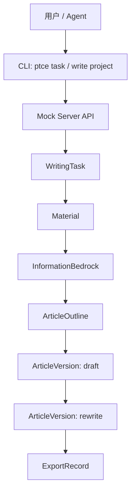
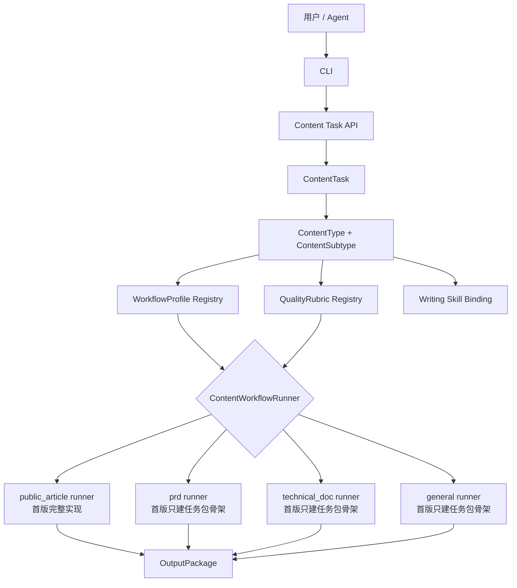
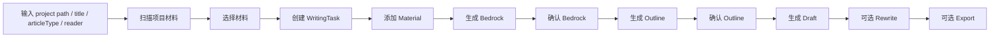
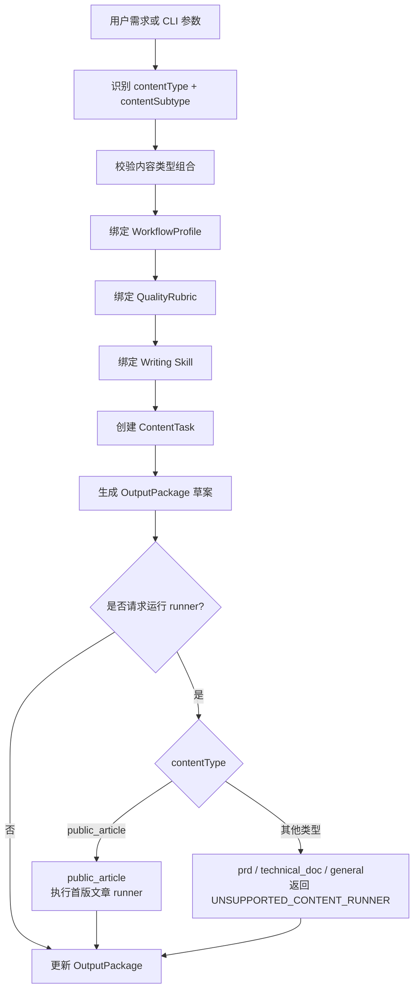
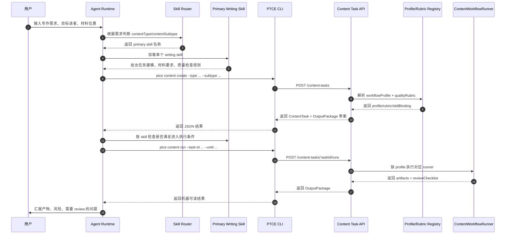

# 内容类型与写作 Skill 分层技术设计，中文 Review 版

## 0. Review 导读

这一版技术设计先回答三个问题：

1. 架构从什么变成什么？
2. 流程从什么变成什么？
3. 这次实施到底要做哪些功能？

后面的领域模型、API、CLI、测试策略都围绕这三件事展开。

注意：下面的“当前架构/当前流程”只用于说明为什么不能把首版设计成单一文章链路，不代表本次要做旧接口兼容。

## 0.1 架构图差异

### 当前架构

当前系统本质上只有一种任务：写文章。



关键问题：

- `WritingTask` 默认所有任务都是文章。
- `articleType` 只是文章子类型，不能表达 PRD、技术文档、通用写作。
- PRD 或技术文档如果复用这条链路，会被错误地塞进 `bedrock -> outline -> draft` 文章模型。

### 目标架构

目标架构先创建内容任务，再由内容类型选择 profile、rubric 和 runner。



架构变化：

| 维度 | 当前 | 本次之后 |
| --- | --- | --- |
| 顶层任务 | `WritingTask` | `ContentTask` |
| 类型字段 | `articleType` | `contentType + contentSubtype` |
| 流程选择 | 固定文章链路 | `WorkflowProfile registry` 决定 |
| 质量标准 | 隐含在生成器里 | `QualityRubric registry` 显式表达 |
| 输出 | draft/rewrite/export | `OutputPackage` 包装不同内容类型的产物 |
| Agent 概念 | 暂无稳定映射 | `ContentType -> writing skill` 映射 |

## 0.2 流程图差异

### 当前流程

当前 `ptce write project` 不管未来用户想写什么，实际都进入文章生成流程。



这个流程适合公开文章，但不适合：

- PRD：缺少 problem、scope、decision、acceptance criteria。
- 技术文档：缺少 source of truth、example validation、correctness check。
- 通用写作：不需要文章级 bedrock/outline/export。

### 本次之后的流程

本次先加内容类型分流。首版只有 `public_article` 实现完整 runner；`prd`、`technical_doc`、`general` 先建立 typed task、profile、rubric 和 output package 骨架，不复用文章 runner。



首版关键边界：

- `public_article`：首版实现 `appeal_brief -> evidence_bedrock -> narrative_outline -> draft -> truth_check -> publication_package`。
- `prd`：可以创建任务、返回 profile/rubric，但不能调用文章 workflow 生成正文。
- `technical_doc`：可以创建任务、返回 profile/rubric，但不能调用文章 workflow 生成正文。
- `general`：可以创建任务、返回 profile/rubric，但不能调用文章 workflow 生成正文。

## 0.3 用户输入后的 CLI / Skill / Agent 时序图

这里描述 agent-driven 使用方式：用户不是直接填所有参数，而是输入一个自然语言需求，由 agent 识别内容类型，加载一个主 writing skill，再调用 CLI 执行。



调用关系要点：

- Agent 是编排者，负责理解用户需求、选择 primary skill、决定调用哪些 CLI 命令。
- Skill 是方法和约束，不直接持久化状态，也不直接绕过 CLI 调 server。
- CLI 是执行入口，负责把 agent 的结构化意图传给 Content Task API。
- Server/API 是状态源，负责创建 `ContentTask`、绑定 profile/rubric、运行 runner、返回 `OutputPackage`。
- 一个任务只加载一个 primary writing skill；`general-writing` 不是所有任务的默认前置步骤。

## 0.4 本次要做的功能列表

| 功能 | 范围 | 交付结果 |
| --- | --- | --- |
| 内容类型模型 | 新增 `ContentType`、`ContentSubtype`、合法组合校验 | shared package 可表达 `public_article/prd/technical_doc/general` |
| 任务模型 | 新增 `ContentTask` | task 响应包含 `contentType/contentSubtype/workflowProfileId/qualityRubricId/skillBindingId` |
| Profile 注册表 | 新增 `WorkflowProfile registry` | 四类内容都有默认 workflow profile |
| Rubric 注册表 | 新增 `QualityRubric registry` | 四类内容都有明确质量优先级和 review checklist |
| Skill 映射 | 新增 `WritingSkillBinding registry` | `ContentType -> primary writing skill` 有稳定契约 |
| OutputPackage | 新增通用输出包装 | public article 返回真实 artifact，其他类型先返回 planned/blocked |
| 元数据 API | 新增 `/content-types`、`/workflow-profiles`、`/quality-rubrics` | CLI、未来 UI、agent 可查询产品能力 |
| 运行 API | 新增 `/content-tasks/:taskId/runs` | 按 profile 运行对应 runner |
| Runner guard | 限制文章 runner | 非 `public_article` 调用文章 runner 时明确失败 |
| CLI content create | 支持 `--type`、`--subtype`、`--audience`、`--purpose` | 可创建四类内容任务 |
| CLI content run | 支持 `--task-id`、`--until` | 可执行首版 public article runner |
| Agent 调用契约 | 明确 user -> agent -> skill -> CLI -> API 时序 | agent 不绕过 CLI 直接写状态 |
| 测试覆盖 | shared/server/cli/e2e | 验证分流、注册表、skill binding、runner guard 行为 |

## 0.5 一句话结论

本设计把 `personal-tech-writing-engine` 的首版核心建模为内容任务编排器：

```text
ContentTask
-> ContentType / ContentSubtype
-> WorkflowProfile
-> QualityRubric
-> ContentWorkflowRunner
-> OutputPackage
```

首版不实现 4 条完整生成链路，而是先抽出产品信息架构和注册表：

```text
ContentTask.contentType
ContentTask.contentSubtype
WorkflowProfile registry
QualityRubric registry
OutputPackage contract
public_article runner 首版完整实现
prd / technical_doc / general 轻量 profile 占位
```

这样可以先把系统从第一版就定义为「多内容类型编排器」，其中 `public_article` 首版具备完整执行链路，其他内容类型先具备清晰边界和可 review 的任务包。

## 1. 背景

如果产品第一版只围绕文章建模，核心对象会自然长成类似 `WritingTask` 的结构：

```ts
export interface ArticleTask {
  id: string;
  title: string;
  articleSubtype: string;
  preferredChannel: ExportChannel;
  audience: string;
  stage: TaskStage;
  createdAt: string;
  updatedAt: string;
}
```

它隐含了两个前提：

- 所有任务都是写文章。
- `articleSubtype` 只是文章内的子类型，不能表达产品层内容类型。

如果直接用文章链路做首版，运行流程会是：

```text
project scan
-> material selection
-> task create
-> material add
-> bedrock
-> outline
-> draft
-> optional rewrite/export
```

这条链路适合 `public_article`，但不适合直接承载 PRD、技术文档和通用写作。PRD 需要问题、范围、决策和验收；技术文档需要读者任务、真实来源、示例验证和维护说明；通用写作需要受众、目的、清晰度和事实边界。

## 2. 目标

首版目标是建立内容类型编排基础设施：

1. 在共享领域模型中引入 `ContentTask`、`ContentType`、`ContentSubtype`。
2. 用 `WorkflowProfile` 描述不同内容类型的阶段、输入、确认闸和产物。
3. 用 `QualityRubric` 描述不同内容类型的质量优先级、硬失败项和 review 问题。
4. 实现 `public_article` 的首版 runner。
5. 为 `prd`、`technical_doc`、`general` 提供轻量 profile 和 rubric，占住产品边界。
6. 提供 `ContentType -> primary writing skill` 映射，明确 agent 如何选择 skill。
7. 提供 CLI 和 API 的首版执行契约，不设计旧字段兼容层。

## 3. 非目标

首版不做：

- 不一次性实现 PRD 完整生成器。
- 不一次性实现 technical doc 的代码/API 自动校验。
- 不把仓库立即改名为 `personal-tech-content-engine`。
- 不设计 `articleType`、`reader` 等旧字段兼容。
- 不让 PRD、技术文档、通用写作复用公开文章 runner。
- 不实现 UI 的内容类型选择页面。
- 不实现跨项目的 `personal-tech-research-engine` 集成，只预留输入对象。

## 4. 核心设计原则

## 4.1 产品层说 content type，agent 层说 skill

产品、API、持久化模型都使用：

```text
contentType
contentSubtype
workflowProfileId
qualityRubricId
```

Agent 执行层再把内容类型映射到 writing skill：

```text
general -> general-writing
public_article -> public-article-writing
prd -> prd-writing
technical_doc -> technical-doc-writing
```

这样可以避免把 agent 内部概念泄露给用户，也避免未来换执行器时破坏产品模型。

## 4.2 一个内容任务只有一个 primary workflow profile

每个 `ContentTask` 只绑定一个 `WorkflowProfile`。专属 profile 可以复用通用写作原则，但运行时不应该同时进入多条主流程。

示例：

- `public_article/project_retrospective` 使用公开文章 profile。
- `prd/mvp_scope` 使用 PRD profile。
- `technical_doc/how_to` 使用技术文档 profile。
- `general/memo` 使用通用写作 profile。

## 4.3 先注册表，后生成器

首版只要求所有内容类型能被识别、创建、返回 profile/rubric/output package 结构；不要求所有内容类型都能生成高质量正文。

这能让系统先具备可扩展边界：

```text
新增内容类型 = 新增 subtype + profile + rubric + runner
```

而不是修改其他内容类型的生成服务。

## 5. 领域模型

## 5.1 枚举

新增在 `packages/shared/src/domain.ts`：

```ts
export type ContentType = 'general' | 'public_article' | 'prd' | 'technical_doc';

export type PublicArticleSubtype =
  | 'narrative_article'
  | 'source_analysis'
  | 'tool_experience'
  | 'project_retrospective';

export type PrdSubtype =
  | 'feature_prd'
  | 'mvp_scope'
  | 'product_strategy'
  | 'requirement_review';

export type TechnicalDocSubtype =
  | 'tutorial'
  | 'how_to'
  | 'reference'
  | 'explanation'
  | 'troubleshooting'
  | 'quickstart';

export type GeneralWritingSubtype =
  | 'memo'
  | 'email'
  | 'explanation'
  | 'mixed_draft';

export type ContentSubtype =
  | PublicArticleSubtype
  | PrdSubtype
  | TechnicalDocSubtype
  | GeneralWritingSubtype;
```

注意：`explanation` 会同时出现在 `technical_doc` 和 `general` 下，所以校验必须使用 `(contentType, contentSubtype)` 组合，不能只校验 subtype 字符串。

## 5.2 ContentTask

第一版直接使用 `ContentTask`，不保留 `WritingTask`、`articleType`、`reader` 等旧模型字段：

```ts
export interface ContentTask {
  id: string;
  title: string;
  contentType: ContentType;
  contentSubtype: ContentSubtype;
  workflowProfileId: string;
  qualityRubricId: string;
  skillBindingId: string;
  preferredChannel?: ExportChannel;
  audience: string;
  purpose?: string;
  sourceRequirements: SourceRequirement[];
  currentStageId: string;
  createdAt: string;
  updatedAt: string;
}
```

创建规则：

- `contentType` 必填；agent-driven 场景由 agent 在调用 CLI 前识别出来。
- `contentSubtype` 必填；agent-driven 场景由 primary skill 帮助 agent 细化。
- `audience` 必填。
- `workflowProfileId` 由 `(contentType, contentSubtype)` 解析得到。
- `qualityRubricId` 由 `(contentType, contentSubtype)` 解析得到。
- `skillBindingId` 由 `contentType` 解析得到。
- `preferredChannel` 只对 `public_article` 有意义，其他内容类型不写入该字段。
- `currentStageId` 使用 profile 的第一个 stage id，而不是文章专用 enum。

## 5.3 SourceRequirement

新增轻量输入约束：

```ts
export interface SourceRequirement {
  kind: 'user_input' | 'project_files' | 'research_package' | 'code_reference' | 'style_sample';
  required: boolean;
  description: string;
}
```

它不是材料本身，而是 profile 对材料的要求。例如技术文档的 `code_reference` 可以标记为必需，公开文章的 `style_sample` 可以标记为可选。

## 6. WorkflowProfile

## 6.1 类型

新增 `packages/shared/src/content-profiles.ts`：

```ts
export interface WorkflowStageDefinition {
  id: string;
  label: string;
  artifactType: string;
  confirmationRequired: boolean;
  requiredBefore?: string[];
}

export interface WorkflowProfile {
  id: string;
  contentType: ContentType;
  contentSubtype?: ContentSubtype;
  stageDefinitions: WorkflowStageDefinition[];
  requiredInputs: SourceRequirement[];
  optionalInputs: SourceRequirement[];
  outputArtifacts: string[];
}
```

## 6.2 默认 profiles

首版提供 4 个 content type 级默认 profile：

```text
public_article.default
-> appeal_brief
-> evidence_bedrock
-> narrative_outline
-> draft
-> truth_check
-> publication_package
```

```text
prd.default
-> problem_brief
-> scenario_model
-> requirement_model
-> scope_boundary
-> acceptance_criteria
-> prd_package
```

```text
technical_doc.default
-> doc_intent
-> reader_task_map
-> source_of_truth_map
-> information_architecture
-> technical_draft
-> correctness_checklist
-> doc_package
```

```text
general.default
-> purpose
-> audience
-> material_cleanup
-> structure_rewrite
-> clarity_check
-> final_text
```

## 6.3 public_article 首版 runner

`public_article` 是首版唯一完整执行的内容类型。runner 的阶段直接按公开文章 profile 命名：

```text
appeal_brief
evidence_bedrock
narrative_outline
draft
truth_check
publication_package
```

对应 artifact：

```text
appeal_brief = AppealBrief
evidence_bedrock = EvidenceBedrock
narrative_outline = NarrativeOutline
draft = ContentDraft
truth_check = TruthCheckReport
publication_package = PublicationPackage
```

如果底层实现临时复用已有 generator 代码，也必须通过上述 artifact 名称对外暴露，不能把 `bedrock/outline/rewrite/export` 作为首版公共模型。

## 7. QualityRubric

## 7.1 类型

新增 `packages/shared/src/quality-rubrics.ts`：

```ts
export interface QualityCriterion {
  id: string;
  label: string;
  description: string;
  required: boolean;
}

export interface QualityRubric {
  id: string;
  contentType: ContentType;
  contentSubtype?: ContentSubtype;
  priorityOrder: string[];
  criteria: QualityCriterion[];
  hardFailures: string[];
  reviewQuestions: string[];
  releaseReadinessRules: string[];
}
```

## 7.2 默认 rubric

默认优先级：

```text
public_article: 美 > 真 > 像
prd: 用 > 真 > 清晰 > 完整 > 美 > 像
technical_doc: 准 > 可执行 > 完整 > 清晰 > 美 > 像
general: 清晰 > 准确 > 有用 > 简洁 > 风格
```

首版 rubric 只参与：

- 任务创建时绑定 `qualityRubricId`
- `/content-types` 元数据响应
- 输出包里的 review checklist
- 未来生成器的输入参数

不要求所有生成器立刻按 rubric 自动评分。

## 8. OutputPackage

## 8.1 类型

新增通用输出包装：

```ts
export interface OutputPackage {
  id: string;
  taskId: string;
  contentType: ContentType;
  contentSubtype: ContentSubtype;
  artifacts: OutputArtifactRef[];
  reviewChecklist: ReviewChecklistItem[];
  readiness: 'draft' | 'review_ready' | 'publish_ready' | 'blocked';
  createdAt: string;
}

export interface OutputArtifactRef {
  artifactType: string;
  artifactId?: string;
  label: string;
  status: 'available' | 'planned' | 'blocked';
}

export interface ReviewChecklistItem {
  id: string;
  label: string;
  status: 'pass' | 'fail' | 'unknown' | 'not_checked';
}
```

## 8.2 public_article 首版输出

`ptce content run` 的结果包含：

```ts
task: ContentTask;
outputPackage: OutputPackage;
workflowProfile: WorkflowProfile;
qualityRubric: QualityRubric;
skillBinding: WritingSkillBinding;
```

`public_article` 输出：

- `appeal_brief` 对应 `AppealBrief`。
- `evidence_bedrock` 对应 `EvidenceBedrock`。
- `narrative_outline` 对应 `NarrativeOutline`。
- `draft` 对应 `ContentDraft`。
- `truth_check` 对应 `TruthCheckReport`。
- `publication_package` 对应 `PublicationPackage`。

## 8.3 Agent skill 映射契约

首版不创建 4 个完整 skill，但 shared package 需要提供稳定映射，供未来 agent 或 CLI 查询：

```ts
export interface WritingSkillBinding {
  contentType: ContentType;
  skillName: string;
  triggerDescription: string;
  primaryOnly: boolean;
}
```

默认映射：

```text
general -> general-writing
public_article -> public-article-writing
prd -> prd-writing
technical_doc -> technical-doc-writing
```

约束：

- `primaryOnly = true`，表示一个任务只选择一个主 writing skill。
- 专属 skill 可以引用 `general-writing` 的小型 reference，但不能要求运行时同时加载完整 `general-writing`。
- `triggerDescription` 只描述触发边界，不塞完整流程，避免 skill description 过宽导致误触发。
- `general-writing` 的触发优先级最低；只有内容类型不明确或用户明确要求通用润色时才使用。

未来如果落成本地 skill 目录，建议仍按 spec 中的目录结构生成：

```text
general-writing/
public-article-writing/
prd-writing/
technical-doc-writing/
```

但 skill 文件消费的是本设计里的 profile/rubric/output package，而不是各自复制一份产品流程。

## 9. API 设计

## 9.1 创建任务

新增 `CreateContentTaskRequest`：

```ts
export interface CreateContentTaskRequest {
  title: string;
  contentType: ContentType;
  contentSubtype: ContentSubtype;
  audience?: string;
  purpose?: string;
  preferredChannel?: ExportChannel;
  sourceMaterialRefs?: string[];
}
```

校验规则：

- `title` 必填。
- `audience` 必填。
- `contentType` 必填。
- `contentSubtype` 必填。
- `(contentType, contentSubtype)` 必须是合法组合。
- `preferredChannel` 只允许在 `public_article` 下使用。
- 创建任务时必须同步解析 `workflowProfileId`、`qualityRubricId`、`skillBindingId`。

## 9.2 新增元数据 API

新增只读端点：

```text
GET /content-types
GET /workflow-profiles
GET /workflow-profiles/:profileId
GET /quality-rubrics
GET /quality-rubrics/:rubricId
GET /writing-skill-bindings
```

这些端点用于 CLI、未来 UI 和 agent 查询能力边界。

## 9.3 内容任务运行 API

新增运行端点：

```text
POST /content-tasks
GET /content-tasks/:taskId
POST /content-tasks/:taskId/runs
GET /content-tasks/:taskId/output-package
```

`POST /content-tasks/:taskId/runs` 请求：

```ts
export interface RunContentTaskRequest {
  untilStageId?: string;
  confirmStages?: string[];
  dryRun?: boolean;
}
```

首版只实现 `public_article` runner。若 task 是 `prd`、`technical_doc` 或 `general`，运行正文生成时返回：

```json
{
  "code": "UNSUPPORTED_CONTENT_RUNNER",
  "message": "This content type has no executable runner in the first version."
}
```

这样可以显式暴露能力边界，避免错误地用公开文章 runner 生成 PRD 或技术文档。

## 10. CLI 设计

## 10.1 `content create`

创建内容任务：

```bash
ptce content create \
  --title "MVP review flow" \
  --type prd \
  --subtype mvp_scope \
  --audience "founder and implementation agent" \
  --purpose "align MVP scope and acceptance criteria"
```

输出包含：

```text
ContentTask
WorkflowProfile
QualityRubric
WritingSkillBinding
OutputPackage draft
```

## 10.2 `content run`

执行内容任务：

```bash
ptce content run \
  --task-id task_123 \
  --until draft \
  --render json
```

首版行为：

- `public_article` 执行 runner。
- `prd`、`technical_doc`、`general` 返回 `UNSUPPORTED_CONTENT_RUNNER`。
- `--render json` 是 agent 调用的默认格式。

## 10.3 `content write-project`

项目材料写作入口只支持 `public_article`：

```bash
ptce content write-project \
  --project-path /path/to/project \
  --title "..." \
  --type public_article \
  --subtype project_retrospective \
  --audience "technical founder" \
  --stop-at draft
```

如果用户传：

```bash
--type technical_doc
```

CLI 应该在本地直接失败，并提示：

```text
ptce content write-project supports public_article only in the first version.
Use `ptce content create --type technical_doc` to create a technical documentation task package.
```

## 11. Server 模块改造

## 11.1 shared package

修改：

- `packages/shared/src/domain.ts`
- `packages/shared/src/contracts.ts`
- `packages/shared/src/index.ts`

新增：

- `packages/shared/src/content-types.ts`
- `packages/shared/src/content-profiles.ts`
- `packages/shared/src/quality-rubrics.ts`
- `packages/shared/src/output-package.ts`

职责：

- 定义内容类型枚举和合法 subtype 组合。
- 提供 `createContentTaskModel(input)`。
- 提供 `getWorkflowProfile(contentType, contentSubtype)`。
- 提供 `getQualityRubric(contentType, contentSubtype)`。
- 提供 `getWritingSkillBinding(contentType)`。

## 11.2 mock-server

修改：

- `packages/mock-server/src/repository/task-repository.ts`
- `packages/mock-server/src/routes/task-routes.ts`
- `packages/mock-server/src/services/task-service.ts`
- `packages/mock-server/src/routes/workflow-routes.ts`
- `packages/mock-server/src/app.ts`

新增：

- `packages/mock-server/src/routes/content-metadata-routes.ts`
- `packages/mock-server/src/workflow/content-workflow-guards.ts`

职责：

- 创建任务时写入 `contentType/contentSubtype/profile/rubric`。
- 注册元数据端点。
- 在 content run API 前加 content runner guard。

## 11.3 cli

修改：

- `packages/cli/src/commands/task.ts`
- `packages/cli/src/commands/write.ts`
- `packages/cli/src/write/types.ts`
- `packages/cli/src/write/workflow-runner.ts`

职责：

- `content create` 创建内容任务。
- `content run` 按 task profile 执行 runner。
- `content write-project` 仅对 `public_article` 放行。
- 输出结果包含 profile/rubric/outputPackage。
- JSON render 保持机器可读；table/human render 只展示核心字段。

## 12. 持久化

当前 mock server 使用 JSON file store。第一版直接写入新模型，不做旧数据迁移。

持久化文件建议：

```text
content-tasks.json
content-artifacts.json
output-packages.json
```

`ContentTask` 写入时必须已经解析完成：

- `workflowProfileId`
- `qualityRubricId`
- `skillBindingId`
- `currentStageId`

读取时只做 schema 校验和缺失报错，不做旧字段补齐。

## 13. 测试策略

## 13.1 shared

新增测试：

- 合法 `(contentType, contentSubtype)` 组合通过。
- 非法组合失败，例如 `prd/how_to`。
- 默认 profile/rubric 可解析。
- 默认 skill binding 可解析。
- `explanation` 在 `general` 和 `technical_doc` 下都能通过组合校验。

## 13.2 mock-server

新增测试：

- `contentType + contentSubtype + audience` 创建 typed task。
- 创建 task 时写入 `workflowProfileId/qualityRubricId/skillBindingId/currentStageId`。
- `/content-types` 返回四类内容类型和 subtype。
- `/workflow-profiles` 返回默认 profile。
- `/quality-rubrics` 返回默认 rubric。
- `/writing-skill-bindings` 返回四类 skill binding。
- 对 `prd` task 调用 `/content-tasks/:taskId/runs` 返回 unsupported runner。
- 对 `public_article` task 调用 `/content-tasks/:taskId/runs` 返回 output package。

## 13.3 cli

新增测试：

- `ptce content create --type prd --subtype mvp_scope` 发送新请求体。
- `ptce content run --task-id <id>` 调用 run API。
- `ptce content write-project --type public_article` 能跑通首版文章 runner。
- `ptce content write-project --type technical_doc` 本地失败并给出明确提示。
- JSON 输出包含 `workflowProfile`、`qualityRubric`、`outputPackage` 字段。

## 14. 发布顺序

建议分 4 个实施切片：

### Slice 1: shared content IA

交付：

- content type/subtype 类型。
- profile/rubric 注册表。
- writing skill binding 注册表。
- shared 单测。

完成后内容类型、profile、rubric、skill binding 的静态边界建立。

### Slice 2: content task API

交付：

- `CreateContentTaskRequest`。
- `ContentTaskRepository`。
- `/content-tasks`。
- `/content-types`、`/workflow-profiles`、`/quality-rubrics`、`/writing-skill-bindings`。
- server 单测。

完成后可以创建四类 typed task，并返回 output package 草案。

### Slice 3: CLI content create/run

交付：

- `ptce content create`。
- `ptce content run`。
- `ptce content write-project`。
- render 输出更新。
- CLI 单测。

完成后 agent 可以通过 CLI 创建任务、运行 public article runner、拒绝不支持的 runner。

### Slice 4: public_article runner

交付：

- `public_article` runner 按 profile 产出 artifacts。
- `OutputPackage` 汇总 public article artifacts。
- 非 public article runner guard。
- e2e 验证。

完成后 `public_article` 成为首版唯一可完整执行的内容类型。

## 15. 风险与取舍

## 15.1 第一版直接使用 ContentTask，切换成本更高

不保留 `WritingTask/articleType/reader` 兼容层会让首版改动更集中，但模型更干净。取舍是：接受一次性更新 CLI、server、tests，换取后续 PRD、技术文档和通用写作不用背文章模型债务。

## 15.2 `currentStageId` 改为 profile stage id

不使用文章专用 `TaskStage` enum 后，stage 校验必须依赖 `WorkflowProfile.stageDefinitions`。这要求 server 在每次 run 前校验 stage 是否属于当前 task profile。

## 15.3 profile 名称早于真实 artifact

`prd`、`technical_doc`、`general` 的部分 artifact 首版可能只是 planned artifact。这是可接受的，因为首版目标是架构边界和任务包，不是一次性完成所有内容生成器。

## 15.4 技术文档如果不做真实校验，容易名不副实

因此首版 technical doc 只允许创建 typed task 和 output package 骨架，不允许复用公开文章 runner 生成正文。真正的 `technical_doc` runner 必须在后续切片中接入代码/API/config source of truth。

## 16. Review 重点

请重点 review 这些判断：

1. 是否接受第一版直接使用 `ContentTask`，不设计旧字段兼容层。
2. 是否接受首版只让 `public_article` 具备完整 runner。
3. `WorkflowProfile` 和 `QualityRubric` 是否应该放在 shared package，而不是 server 内部。
4. `currentStageId` 是否应该第一版就使用 profile stage id。
5. `OutputPackage` 是否应该现在引入，还是等 public_article 成品包改造时再引入。
6. `prd`、`technical_doc`、`general` 是否应该只创建 typed task，不生成正文。
7. agent-driven 场景下，是否接受 skill 只指导 agent，所有状态写入都必须走 CLI/API。

## 17. 验收标准

这个技术设计落地后的验收标准：

- `ptce content create --type prd --subtype mvp_scope` 能创建 typed task。
- 任务响应包含 `contentType`、`contentSubtype`、`workflowProfileId`、`qualityRubricId`。
- `/content-types` 能返回四类内容类型和首批 subtype。
- `/workflow-profiles` 能返回四类默认 profile。
- `/quality-rubrics` 能返回四类默认 rubric。
- `/writing-skill-bindings` 能返回四类 primary writing skill 映射。
- `ptce content run` 对 `public_article` 能返回 output package。
- `ptce content run` 对非 `public_article` task 会被明确拒绝。
- 新增内容类型时只需要新增 subtype/profile/rubric/skillBinding/runner，不需要修改 public article runner。

## 18. 后续计划入口

如果本设计确认，下一份实施计划建议命名为：

```text
docs/superpowers/plans/2026-05-02-content-task-profile-rubric-registry.md
```

实施计划应从 shared package 的类型和注册表开始，再进入 server task API，最后接 CLI 和 public article profile 输出包。
