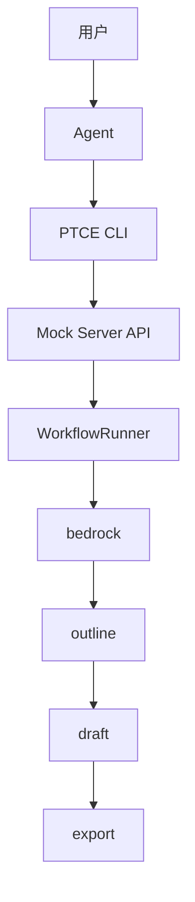
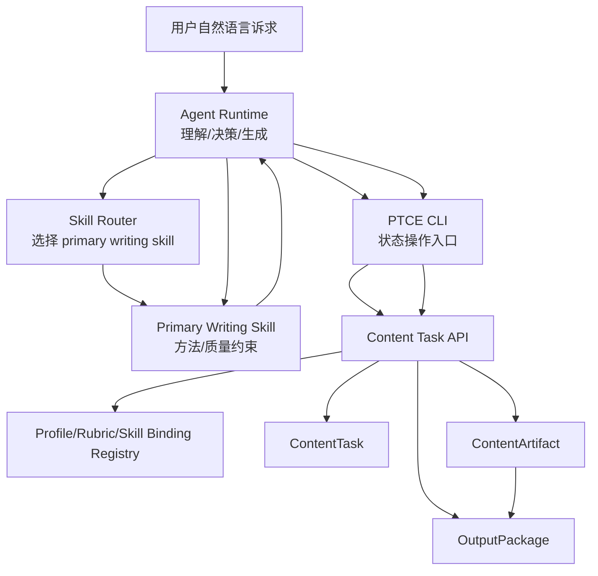
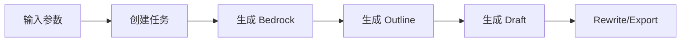
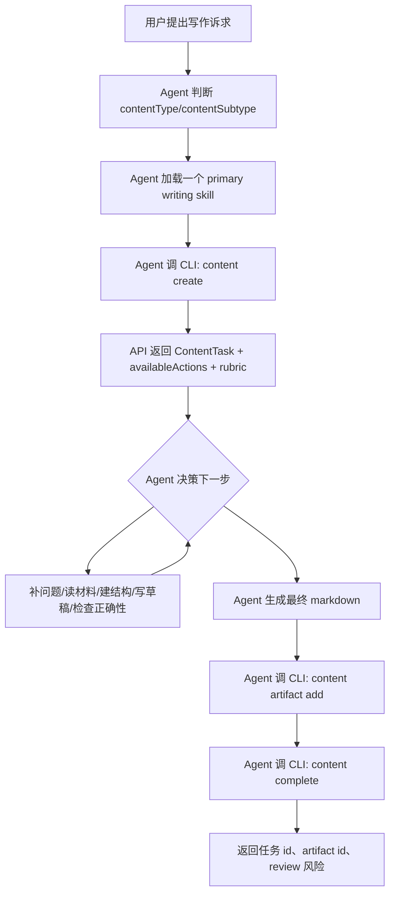
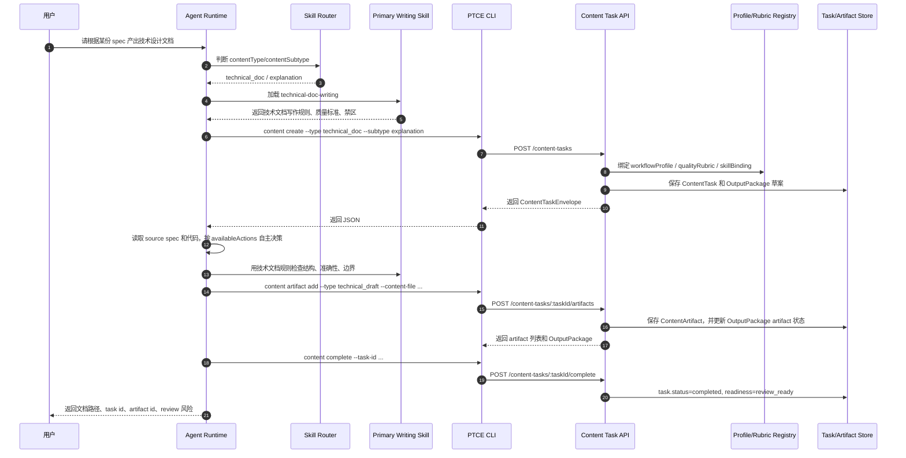

# 内容类型与写作 Skill 分层架构技术设计，Agentic MVP Review 版

## 0. Review 导读

这份文档面向工程团队 review，基于 `docs/superpowers/specs/2026-05-02-content-type-writing-skill-architecture.zh.md`，同时吸收本轮讨论后的约束：

- 这是第一版，不需要兼容旧设计。
- 固定 stage 推进不够 agentic，阶段选择应由模型根据任务状态决策。
- 用户应能直接和模型对话，提出写作诉求，然后产出一篇文档。
- 中间过程必须能调用 writing skill 和 PTCE CLI，不能绕过 CLI 直接写状态。

一句话结论：

```text
Agent 负责理解用户、选择 skill、决策下一步、生成内容；
PTCE CLI/API 负责创建任务、保存 artifact、标记任务完成；
WorkflowProfile 不再是强制线性流程，而是模型可选择的 action contract。
```

## 1. 架构图差异

### 1.1 旧架构：WorkflowRunner 中心

旧思路里，CLI 或 API 里的 workflow runner 拥有主要流程控制权。用户或 agent 只是提供参数，后续由 runner 按固定阶段推进。



问题：

- Runner 假设流程是线性的。
- 阶段顺序由代码决定，不由模型根据上下文决定。
- PRD、技术文档、通用写作会被迫套进文章式流程。
- 用户和模型的对话能力不能自然进入中间决策。

### 1.2 新架构：Agent 编排，PTCE 管状态

新架构里，Agent Runtime 是编排者。它根据用户自然语言诉求选择内容类型、加载一个主 writing skill、调用 CLI 创建任务、生成文档、回写 artifact。



核心变化：

| 维度 | 旧设计 | 新设计 |
| --- | --- | --- |
| 流程控制者 | `WorkflowRunner` | `Agent Runtime` |
| 阶段模型 | 固定 stage 顺序 | `availableActions` + 模型决策 |
| skill 作用 | 辅助提示或隐式规则 | 单个 primary writing skill 是执行约束 |
| CLI 作用 | 触发完整 workflow | 创建任务、保存 artifact、标记完成 |
| API 作用 | 执行生成流程 | 保存状态、返回 profile/rubric/output package |
| 非文章内容 | 容易误用文章 runner | agent 生成内容，CLI/API 只管 typed task 和 artifact |

## 2. 流程图差异

### 2.1 旧流程：固定阶段推进



这个流程适合公开文章，但不适合技术设计文档。技术设计文档更需要：

- 明确读者任务。
- 追溯 source of truth。
- 对齐实际代码和 API。
- 暴露风险、边界和 review 问题。

### 2.2 新流程：模型决策循环



关键点：

- `WorkflowProfile.availableActions` 是可选动作集合，不是硬编码 stage pipeline。
- 模型可以根据材料缺口决定先问问题、先读代码、先写结构，或直接出草稿。
- CLI/API 不判断文档质量，只提供任务状态和 artifact 持久化。
- `complete` 只能在最终 artifact 已写入后调用。

## 3. 本次 MVP 功能列表

| 功能 | 范围 | 交付结果 |
| --- | --- | --- |
| 内容类型模型 | 新增 `ContentType`、`ContentSubtype`、合法组合 | 支持 `general/public_article/prd/technical_doc` |
| 内容任务 | 新增 `ContentTask` | 保存类型、子类型、audience、purpose、当前 action、状态 |
| Agentic Profile | `WorkflowProfile.availableActions`、`artifactContracts`、`decisionPolicy` | 模型拿到可选动作，而不是被固定阶段驱动 |
| Quality Rubric | 每类内容绑定质量优先级和 review 问题 | `technical_doc` 使用 `准 > 可执行 > 完整 > 清晰 > 美 > 像` |
| Skill Binding | `ContentType -> primary writing skill` | 四类内容都有 repo-local primary skill |
| OutputPackage | 保存预期 artifact、review checklist、readiness | 支持 draft/review_ready 状态 |
| ContentArtifact | 新增真实内容 artifact | agent 生成的 markdown 可以写回任务 |
| API | 创建任务、查询任务、添加 artifact、查询 artifacts、完成任务 | `/content-tasks` 系列接口 |
| CLI | `content create`、`content artifact add`、`content complete` | agent 必须通过 CLI 操作状态 |
| 编排 skill | `.agents/skills/ptce-content-writing/SKILL.md` | 约束 agent 如何对话、选类型、调用 CLI、回写 artifact |
| Primary writing skills | 产出 4 个 repo-local writing skill | `general-writing`、`public-article-writing`、`prd-writing`、`technical-doc-writing` |
| WeChat 排版检查 | `public_article` 增加 `wechat_layout_check` | 公众号长文在保存最终 draft 前必须通过排版 rubric |

## 4. 四个 primary writing skill

本设计要求第一版同时产出 4 个 primary writing skill，而不是只在 registry 里声明 skill 名称。

目录结构：

```text
.agents/skills/
  ptce-content-writing/
    SKILL.md
  general-writing/
    SKILL.md
  public-article-writing/
    SKILL.md
  prd-writing/
    SKILL.md
  technical-doc-writing/
    SKILL.md
```

职责边界：

| Skill | 触发内容类型 | 职责 | 不负责 |
| --- | --- | --- | --- |
| `ptce-content-writing` | 用户要求通过 PTCE 从自然语言产出文档 | 编排 content task、选择 primary skill、调用 CLI、保存 artifact | 不承载具体文体写作方法 |
| `general-writing` | `general` | 通用说明、邮件、备忘录、混合草稿、清晰度改写 | 不抢 PRD、公开文章、技术文档任务 |
| `public-article-writing` | `public_article` | 公众号、博客、公开文章、项目复盘、技术叙事 | 不写内部执行规格或 API reference |
| `prd-writing` | `prd` | PRD、MVP scope、feature spec、验收标准、需求 review | 不写宣传稿或技术参考文档 |
| `technical-doc-writing` | `technical_doc` | 技术设计、架构说明、API 文档、README、runbook、故障排查 | 不写 PRD 或公开传播文章 |

`ptce-content-writing` 是编排 skill；另外 4 个是 primary writing skill。执行一个内容任务时只能加载一个 primary writing skill。

映射关系：

```text
general -> general-writing
public_article -> public-article-writing
prd -> prd-writing
technical_doc -> technical-doc-writing
```

如果 primary writing skill 不存在，应视为配置错误并停止，不允许静默降级成通用写作。

## 5. 用户输入后的时序图



说明：

- Skill 不直接写数据库，也不直接调 API。
- Agent 可以读文件、理解上下文、生成内容，但状态变化必须通过 CLI。
- CLI 是 agent 和 PTCE 状态系统之间的稳定边界。

## 6. 领域模型

### 6.1 ContentTask

`ContentTask` 是新顶层对象：

```ts
export interface ContentTask {
  id: string;
  title: string;
  contentType: ContentType;
  contentSubtype: ContentSubtype;
  workflowProfileId: string;
  qualityRubricId: string;
  skillBindingId: string;
  preferredChannel?: ExportChannel;
  audience: string;
  purpose?: string;
  sourceRequirements: SourceRequirement[];
  currentActionId: string;
  status: ContentTaskStatus;
  createdAt: string;
  updatedAt: string;
}
```

第一版不需要兼容旧的 `WritingTask/articleType/reader`。旧文章链路可以继续存在于仓库中，但新内容任务不以旧模型为契约。

### 6.2 WorkflowProfile

`WorkflowProfile` 不再表达“必须按顺序执行的阶段”，而表达“这个内容类型允许模型做哪些动作、会产出哪些 artifact”。

```text
public_article.default
availableActions:
- appeal_brief
- evidence_bedrock
- narrative_outline
- draft
- wechat_layout_check
- truth_check
- publication_package
```

```text
technical_doc.default
availableActions:
- doc_intent
- reader_task_map
- source_of_truth_map
- information_architecture
- technical_draft
- correctness_checklist
- doc_package

decisionPolicy:
Model chooses the next allowed action based on available artifacts, rubric, and user intent.
```

### 6.3 OutputPackage 与 ContentArtifact

`OutputPackage` 是任务的交付包状态，`ContentArtifact` 是真实内容。

```ts
export interface ContentArtifact {
  id: string;
  taskId: string;
  artifactType: string;
  title: string;
  content: string;
  format: 'markdown' | 'json' | 'text';
  createdBy: 'agent' | 'model' | 'user' | 'system';
  createdAt: string;
}
```

当 agent 调用 `content artifact add` 后：

- server 保存 `ContentArtifact`。
- server 根据 `artifactType` 把 `OutputPackage.artifacts[*].status` 从 `planned` 更新为 `available`。
- server 写入 `artifactId`。

## 7. API 设计

### 7.1 创建内容任务

```http
POST /content-tasks
```

请求：

```json
{
  "title": "内容类型与写作 Skill 分层技术设计",
  "contentType": "technical_doc",
  "contentSubtype": "explanation",
  "audience": "工程团队 reviewer 和后续实现 agent",
  "purpose": "说明架构、流程、接口、数据模型和实现边界"
}
```

响应返回：

- `task`
- `workflowProfile`
- `qualityRubric`
- `skillBinding`
- `outputPackage`

### 7.2 添加内容 artifact

```http
POST /content-tasks/:taskId/artifacts
```

请求：

```json
{
  "artifactType": "technical_draft",
  "title": "内容类型与写作 Skill 分层架构技术设计",
  "content": "...markdown...",
  "format": "markdown",
  "createdBy": "agent"
}
```

响应返回更新后的 envelope 和 artifacts 列表。

### 7.3 完成任务

```http
POST /content-tasks/:taskId/complete
```

效果：

- `task.status = completed`
- `task.currentActionId = finish`
- `outputPackage.readiness = review_ready`

## 8. CLI 设计

### 8.1 创建任务

```bash
node --import tsx packages/cli/src/index.ts content create \
  --title "内容类型与写作 Skill 分层技术设计" \
  --type technical_doc \
  --subtype explanation \
  --audience "工程团队 reviewer 和后续实现 agent" \
  --purpose "说明架构、流程、接口、数据模型和实现边界" \
  --render json
```

### 8.2 写入 artifact

```bash
node --import tsx packages/cli/src/index.ts content artifact add \
  --task-id <taskId> \
  --type technical_draft \
  --title "内容类型与写作 Skill 分层架构技术设计" \
  --content-file docs/superpowers/specs/2026-05-03-content-type-writing-skill-architecture-agentic-technical-design.zh.md \
  --format markdown \
  --created-by agent \
  --render json
```

### 8.3 完成任务

```bash
node --import tsx packages/cli/src/index.ts content complete \
  --task-id <taskId> \
  --render json
```

## 9. Agent / Skill 执行契约

### 9.1 Agent 负责的事

- 从用户自然语言里判断 `contentType/contentSubtype`。
- 只加载一个 primary writing skill。
- 发现缺少必要信息时向用户追问。
- 读取用户指定的 source 文件和必要代码。
- 根据 profile 的 `availableActions` 自主决定下一步。
- 生成最终文档。
- 调 CLI 写入 artifact 和完成任务。

### 9.2 Skill 负责的事

Skill 是方法和质量约束，不是状态系统。

对于技术设计文档，skill 至少要约束：

- 读者是谁。
- 读者 review 时需要判断什么。
- source of truth 是哪些文件和接口。
- 架构、流程、数据模型、API、CLI、测试边界是否闭环。
- 哪些能力是 MVP，哪些不是。

四个 primary writing skill 都应落盘为 repo-local skill 文件，并作为 `WritingSkillBinding` 的真实目标。

### 9.3 CLI/API 负责的事

- 校验内容类型和基础字段。
- 创建并保存任务。
- 返回 profile/rubric/skill binding。
- 保存 agent 生成的 artifact。
- 更新 output package readiness。

CLI/API 不负责替 agent 写技术设计正文。

## 10. MVP 边界

本 MVP 做：

- typed content task。
- agentic profile/rubric/skill binding。
- 4 个 primary writing skill。
- CLI 驱动的 task/artifact/complete 闭环。
- agent 和用户对话后生成技术文档。

本 MVP 不做：

- 不实现独立的 `technical_doc` server-side runner。
- 不自动校验所有代码/API 示例。
- 不实现 UI。
- 不实现多 skill 同时协作。

## 11. Review 重点

请重点 review 这些问题：

1. `Agent Runtime` 作为流程编排者是否符合产品方向？
2. `WorkflowProfile.availableActions` 是否足够表达“模型自己决策下一步”？
3. `ContentArtifact` 是否应该在第一版区分 `draft/review_summary/check_report` 等更强类型？
4. `content complete` 是否需要强制检查至少一个 final artifact 已存在？
5. 四个 primary writing skill 的职责边界是否足够清楚，是否会互相抢触发？
6. `OutputPackage.readiness = review_ready` 是否应该由 agent 显式提交 checklist 后才能置位？

## 12. 当前设计结论

这版设计把 PTCE 第一版从“写文章 workflow”改成“agentic content task system”：

```text
User natural-language request
-> Agent classifies content type
-> Agent loads one primary writing skill
-> CLI creates ContentTask
-> API returns availableActions/rubric/output package
-> Agent writes document
-> CLI stores ContentArtifact
-> CLI marks task review_ready
```

这能先走通用户真正想要的路径：和模型对话，提出诉求，中间调用 skill 和 CLI，最后产出一篇可 review 的文档。
